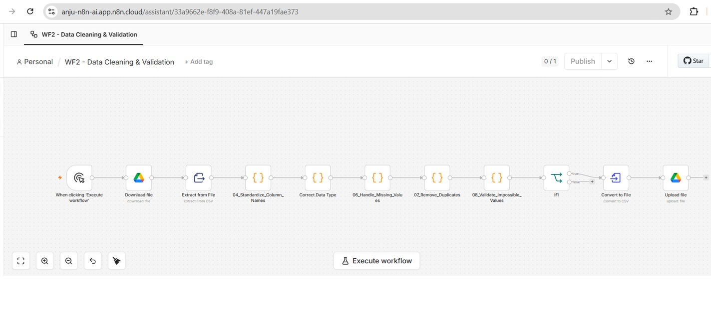

# 🌬️ Wind Turbine SCADA Anomaly Detection & Alerting Pipeline

**An end-to-end Data Analytics and AI project for automating Wind Turbine SCADA telemetry ingestion, data cleaning, anomaly detection, intelligent alerting, and interactive Power BI dashboards.**

---

## 📌 Project Overview

This project demonstrates an end-to-end analytics pipeline that processes Wind Turbine SCADA telemetry data to improve operational monitoring and enable early fault detection.

The pipeline automates:

- 📥 Data Ingestion
- 🧹 Data Cleaning & Validation
- ⚠️ Rule-Based Anomaly Detection
- 🗄️ PostgreSQL Data Storage
- 📊 Power BI Dashboarding
- 🤖 AI-Generated Alert Summaries
- 📧 Automated Email Notifications

---

## 🚀 Tech Stack

- Python
- n8n
- PostgreSQL (Neon)
- Power BI
- Groq LLM
- SQL
- Git & GitHub

  ---

  ## ✨ Project Highlights
✔ Automated SCADA Data Ingestion

✔ Data Cleaning & Validation

✔ Missing Value Handling

✔ Impossible Value Detection

✔ Rule-Based Anomaly Detection

✔ PostgreSQL Data Warehouse

✔ Interactive Power BI Dashboards

✔ AI-Generated Alert Summaries

✔ Automated Email Notifications

✔ Workflow Automation with n8n

---

## 📂 Dataset

### Raw Dataset
- Original 10-minute Wind Turbine SCADA telemetry data
- Contains missing values, inconsistent formats, and invalid records

### Processed Dataset
- Standardized column names
- Corrected data types
- Removed invalid records
- Handled missing values
- Ready for anomaly detection and Power BI reporting

---

## 🔄 n8n Data Cleaning Workflow

